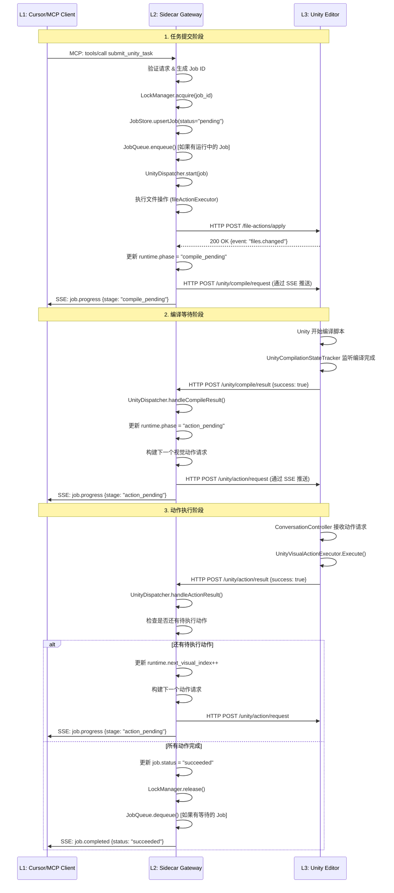
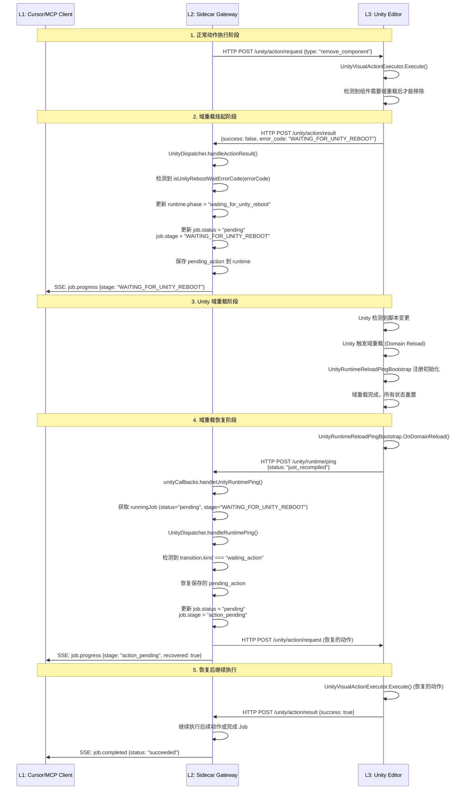
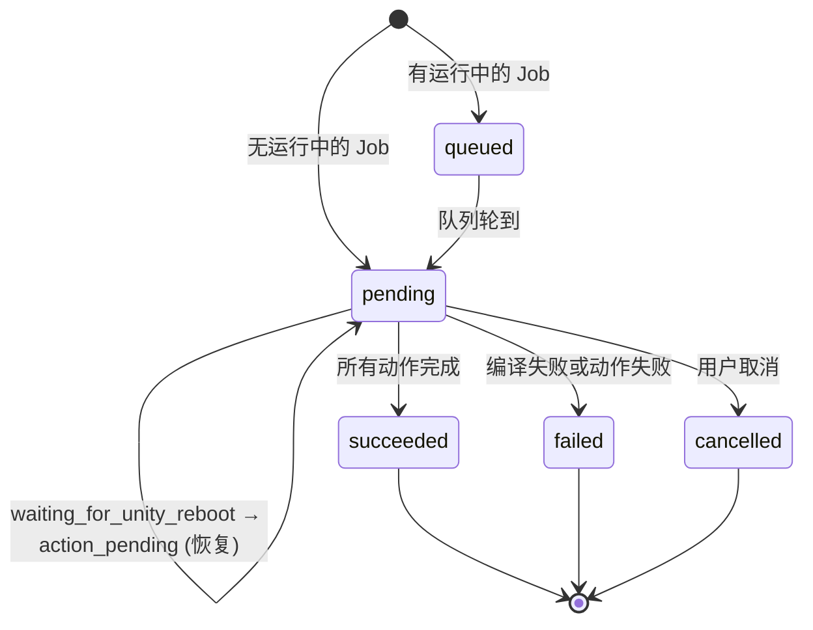
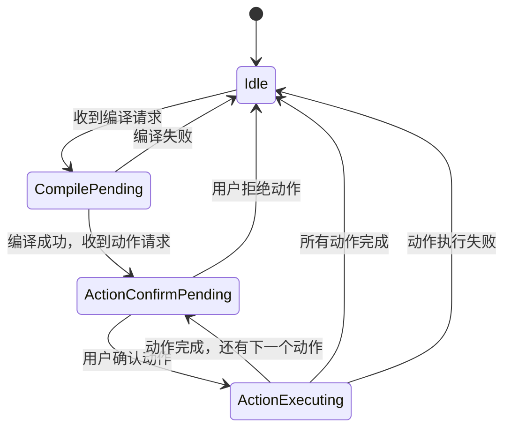

# Codex-Unity 架构基线文档 v3.0

**文档版本**: v3.0  
**生成时间**: 2024-12-19  
**架构状态**: 已完成"去脑化与网关化"重构，系统处于纯净状态

---

## 📋 目录

1. [宏观架构分层](#1-宏观架构分层)
2. [核心数据流转图](#2-核心数据流转图)
3. [代码目录树与模块字典](#3-代码目录树与模块字典)
4. [核心状态机与数据模型](#4-核心状态机与数据模型)
5. [下一步接入点预留](#5-下一步接入点预留)

---

## 1. 宏观架构分层

### 1.1 三层架构概览

系统采用严格的三层架构，职责清晰分离：

```
┌─────────────────────────────────────────────────────────┐
│  L1 大脑层 (Cursor / MCP Client)                        │
│  ────────────────────────────────────────────────────  │
│  职责：系统的唯一决策者                                  │
│  • 自然语言理解与任务规划                                │
│  • 通过 MCP 协议调用 L2 网关                            │
│  • 接收 SSE 事件流进行状态同步                           │
└─────────────────────────────────────────────────────────┘
                          ↕ MCP Protocol (JSON-RPC + SSE)
┌─────────────────────────────────────────────────────────┐
│  L2 脊髓/网关层 (Node.js Sidecar)                        │
│  ────────────────────────────────────────────────────  │
│  职责：纯粹的 API 网关与状态协调器                        │
│  • MCP 协议转换 (JSON-RPC ↔ HTTP)                       │
│  • 并发互斥锁管理 (LockManager)                         │
│  • 有界任务队列 (JobQueue, max=1)                       │
│  • 域重载挂起与恢复 (WAITING_FOR_UNITY_REBOOT)          │
│  • SSE 状态推送 (McpStreamHub)                          │
│  • Job 生命周期管理 (JobStore, JobRecovery)              │
└─────────────────────────────────────────────────────────┘
                          ↕ HTTP REST API
┌─────────────────────────────────────────────────────────┐
│  L3 物理层 (Unity C# Editor)                             │
│  ────────────────────────────────────────────────────  │
│  职责：纯物理执行器与感知提供者                           │
│  • 视觉动作执行 (UnityVisualActionExecutor)             │
│  • 编译门禁管理 (UnityCompilationStateTracker)            │
│  • 进程生命周期管理 (SidecarProcessManager)               │
│  • 域重载唤醒 (UnityRuntimeReloadPingBootstrap)          │
│  • 场景感知提供 (UnitySelectionContextBuilder)           │
└─────────────────────────────────────────────────────────┘
```

### 1.2 L1 大脑层：Cursor / MCP Client

**定位**: 系统的唯一决策者，负责所有智能决策和任务规划。

**核心能力**:
- 通过 MCP (Model Context Protocol) 与 L2 通信
- 调用 MCP Tools: `submit_unity_task`, `get_unity_task_status`, `cancel_unity_task`
- 订阅 MCP Resources: `unity://selection`, `unity://hierarchy`, `unity://components`
- 接收 SSE 事件流: `job.progress`, `job.completed`, `job.failed`

**关键约束**:
- L1 不直接与 L3 通信，所有交互必须经过 L2
- L1 不维护任何 Unity 状态，仅通过 L2 获取状态快照

### 1.3 L2 脊髓/网关层：Node.js Sidecar

**定位**: 纯粹的 API 网关，负责协议转换、并发控制、状态协调。

#### 核心能力详解

**A. MCP 协议转换**
- **文件**: `src/mcp/mcpServer.js`
- **职责**: 将 MCP JSON-RPC 请求转换为内部 HTTP 调用
- **关键方法**: `processRequest()`, `callTool()`, `listResources()`, `readResource()`

**B. 并发互斥锁管理**
- **文件**: `src/application/jobRuntime/lockManager.js`
- **职责**: 确保同一时刻只有一个 Unity Job 处于运行状态
- **机制**: 基于内存的互斥锁，支持锁获取/释放

**C. 有界任务队列**
- **文件**: `src/application/jobRuntime/jobQueue.js`
- **职责**: 管理等待执行的 Job，默认最大队列长度 = 1
- **机制**: FIFO 队列，支持入队/出队/移除操作

**D. 域重载挂起与恢复**
- **文件**: `src/application/mcpGateway/unityCallbacks.js` (handleUnityRuntimePing)
- **职责**: 处理 Unity 域重载后的状态恢复
- **机制**: 
  - 当动作执行遇到 `WAITING_FOR_UNITY_REBOOT` 错误时，Job 进入 `suspended_for_reboot` 状态
  - Unity 重启后通过 `unity.runtime.ping` 唤醒 L2
  - L2 恢复挂起的动作请求并继续执行

**E. SSE 状态推送**
- **文件**: `src/application/mcpGateway/mcpStreamHub.js`
- **职责**: 向 MCP Client 推送 Job 状态变更事件
- **事件类型**: `job.progress`, `job.completed`, `job.failed`
- **机制**: 
  - 支持多订阅者（默认最大 32 个）
  - 事件历史回放（默认最大 500 个事件）
  - 断线重连恢复（默认最大 20 个 Job）

**F. Job 生命周期管理**
- **文件**: 
  - `src/application/jobRuntime/jobStore.js` - Job 存储
  - `src/application/jobRuntime/jobRecovery.js` - Job 持久化与恢复
- **职责**: 管理 Job 的创建、更新、查询、持久化
- **机制**: 内存存储 + 文件快照持久化

### 1.4 L3 物理层：Unity C# Editor

**定位**: 纯物理执行器与感知提供者，不包含任何决策逻辑。

#### 核心能力详解

**A. 视觉动作执行**
- **文件**: `Assets/Editor/Codex/Infrastructure/UnityVisualActionExecutor.cs`
- **职责**: 执行所有 Unity 场景中的视觉层动作
- **支持动作类型**:
  - `add_component` - 添加组件
  - `remove_component` - 移除组件
  - `replace_component` - 替换组件
  - `create_gameobject` - 创建 GameObject

**B. 编译门禁管理**
- **文件**: `Assets/Editor/Codex/Infrastructure/UnityCompilationStateTracker.cs`
- **职责**: 跟踪 Unity 编译状态，在编译完成后报告结果
- **机制**: 监听 `EditorApplication.compilationFinished` 事件

**C. 进程生命周期管理**
- **文件**: `Assets/Editor/Codex/Infrastructure/SidecarProcessManager.cs`
- **职责**: 管理 Sidecar 进程的启动、停止、健康检查
- **机制**: 基于 Node.js 子进程管理

**D. 域重载唤醒**
- **文件**: `Assets/Editor/Codex/Infrastructure/UnityRuntimeReloadPingBootstrap.cs`
- **职责**: 在 Unity 域重载后自动发送 `unity.runtime.ping` 唤醒 L2
- **机制**: 在 `[InitializeOnLoad]` 中注册，监听域重载事件

**E. 场景感知提供**
- **文件**: `Assets/Editor/Codex/Infrastructure/UnitySelectionContextBuilder.cs`
- **职责**: 构建 Unity 场景的上下文快照（选择对象、组件树、场景修订号）
- **用途**: 为 L1 提供场景感知能力

---

## 2. 核心数据流转图

### 2.1 常规写动作流程

完整的写动作流程从 Cursor 调用 `submit_unity_task` 开始，到 L2 通过 SSE 推送 `job.completed` 结束。



**关键数据流**:
1. **任务提交**: Cursor → L2 (MCP) → L2 内部处理 → L3 (HTTP)
2. **状态同步**: L2 → Cursor (SSE 事件流)
3. **结果回传**: L3 → L2 (HTTP) → L2 内部处理 → Cursor (SSE)

### 2.2 域重载挂起与恢复流程

当 Unity 脚本修改触发域重载时，系统会进入挂起状态，等待 Unity 重启后恢复执行。



**关键机制**:
1. **挂起检测**: L3 在执行动作时检测到需要域重载，返回 `WAITING_FOR_UNITY_REBOOT` 错误码
2. **状态保存**: L2 将待执行的动作保存到 `runtime.last_action_request` 中
3. **自动唤醒**: Unity 域重载后，`UnityRuntimeReloadPingBootstrap` 自动发送 `unity.runtime.ping`
4. **状态恢复**: L2 收到 ping 后，恢复挂起的动作并继续执行

---

## 3. 代码目录树与模块字典

### 3.1 L2 Sidecar 核心目录树

```
sidecar/src/
├── mcp/
│   └── mcpServer.js                    # MCP 协议服务器，处理 JSON-RPC 请求
│
├── application/
│   ├── mcpGateway/
│   │   ├── mcpGateway.js               # MCP 网关核心，任务提交与状态查询
│   │   ├── jobLifecycle.js             # Job 生命周期管理（启动、完成、发布）
│   │   ├── unityCallbacks.js           # Unity 回调处理（编译结果、动作结果、运行时 ping）
│   │   ├── mcpStreamHub.js             # SSE 事件流推送中心
│   │   ├── mcpEyesService.js           # MCP Eyes 服务入口（读/写操作）
│   │   ├── mcpEyesReadService.js       # MCP Eyes 读服务（选择、组件、层次结构）
│   │   ├── mcpEyesWriteService.js      # MCP Eyes 写服务（脚本操作、视觉操作）
│   │   └── mcpErrorFeedback.js         # MCP 错误反馈格式化
│   │
│   ├── jobRuntime/
│   │   ├── jobQueue.js                 # 有界任务队列（FIFO，默认 max=1）
│   │   ├── lockManager.js              # 并发互斥锁管理（确保单 Job 运行）
│   │   ├── jobStore.js                 # Job 内存存储（创建、查询、更新）
│   │   └── jobRecovery.js              # Job 持久化与恢复（文件快照）
│   │
│   ├── unityDispatcher/
│   │   ├── unityDispatcher.js          # Unity 动作调度器（编译/动作流程编排）
│   │   ├── runtimeUtils.js             # 运行时工具函数（状态规范化、动作匹配）
│   │   └── reportBuilder.js            # 执行报告构建器
│   │
│   ├── turnService.js                  # Turn 服务（兼容层，已降级）
│   ├── unitySnapshotService.js         # Unity 快照服务（选择上下文管理）
│   └── preconditionService.js          # 前置条件服务（快照验证）
│
├── domain/
│   ├── validators.js                   # 数据验证器（请求/响应验证）
│   └── turnStore.js                    # Turn 存储（兼容层，已降级）
│
├── infrastructure/
│   ├── serverFactory.js                # HTTP 服务器工厂
│   ├── httpIO.js                       # HTTP I/O 工具
│   └── fileStateSnapshotStore.js       # 文件状态快照存储
│
├── adapters/
│   ├── fileActionExecutor.js           # 文件操作执行适配器
│   ├── argAdapter.js                   # 参数适配器
│   └── clockAdapter.js                 # 时钟适配器
│
├── api/
│   └── router.js                       # HTTP 路由定义
│
├── ports/
│   └── contracts.js                    # 端口契约定义
│
├── utils/
│   └── turnUtils.js                    # Turn 工具函数（状态转换、ID 生成）
│
└── index.js                            # 应用入口，服务器启动
```

### 3.2 L3 Unity Editor 核心目录树

```
Assets/Editor/Codex/
├── Application/
│   └── ConversationController.cs      # 物理协调器（已降级，仅保留编译/动作协调）
│
├── Infrastructure/
│   ├── HttpSidecarGateway.cs           # HTTP Sidecar 网关（所有 L2 API 调用）
│   ├── UnityVisualActionExecutor.cs     # 视觉动作执行器（add/remove/replace component, create GameObject）
│   ├── SidecarProcessManager.cs        # Sidecar 进程管理器（启动/停止/健康检查）
│   ├── UnityCompilationStateTracker.cs  # Unity 编译状态跟踪器
│   ├── UnityRuntimeReloadPingBootstrap.cs # 域重载 Ping 引导器（自动唤醒 L2）
│   ├── UnitySelectionContextBuilder.cs  # 选择上下文构建器（场景快照）
│   ├── UnitySceneRevisionTracker.cs    # 场景修订号跟踪器
│   └── UnityConsoleErrorTracker.cs     # Unity 控制台错误跟踪器
│
├── Domain/
│   └── SidecarContracts.cs            # Sidecar 契约定义（DTO、枚举、响应模型）
│
├── Ports/
│   ├── ISidecarGateway.cs              # Sidecar 网关接口
│   ├── IUnityVisualActionExecutor.cs   # 视觉动作执行器接口
│   ├── ISidecarProcessManager.cs       # 进程管理器接口
│   ├── ISelectionContextBuilder.cs     # 选择上下文构建器接口
│   └── IConversationStateStore.cs      # 对话状态存储接口
│
└── UI/
    └── CodexChatWindow.cs              # Codex 聊天窗口（已精简，仅保留动作确认 UI）
```

### 3.3 核心模块职责说明

#### L2 核心模块

| 模块 | 文件路径 | 单一职责 |
|------|---------|---------|
| **MCP Gateway** | `application/mcpGateway/mcpGateway.js` | MCP 协议转换，任务提交与状态查询的核心入口 |
| **Job Queue** | `application/jobRuntime/jobQueue.js` | 有界 FIFO 队列，管理等待执行的 Job（默认 max=1） |
| **Lock Manager** | `application/jobRuntime/lockManager.js` | 并发互斥锁，确保同一时刻只有一个 Job 运行 |
| **Job Store** | `application/jobRuntime/jobStore.js` | Job 内存存储，提供创建、查询、更新接口 |
| **Job Recovery** | `application/jobRuntime/jobRecovery.js` | Job 持久化与恢复，支持进程重启后状态恢复 |
| **Unity Dispatcher** | `application/unityDispatcher/unityDispatcher.js` | Unity 动作调度器，编排编译→动作执行的完整流程 |
| **MCP Stream Hub** | `application/mcpGateway/mcpStreamHub.js` | SSE 事件流推送中心，向 MCP Client 推送 Job 状态变更 |
| **Unity Callbacks** | `application/mcpGateway/unityCallbacks.js` | Unity 回调处理器，处理编译结果、动作结果、运行时 ping |
| **MCP Eyes Read** | `application/mcpGateway/mcpEyesReadService.js` | MCP Eyes 读服务，提供选择、组件、层次结构的查询接口 |

#### L3 核心模块

| 模块 | 文件路径 | 单一职责 |
|------|---------|---------|
| **Visual Action Executor** | `Infrastructure/UnityVisualActionExecutor.cs` | 视觉动作执行器，执行所有 Unity 场景中的物理操作 |
| **HTTP Sidecar Gateway** | `Infrastructure/HttpSidecarGateway.cs` | HTTP Sidecar 网关，封装所有与 L2 的 HTTP 通信 |
| **Runtime Reload Ping** | `Infrastructure/UnityRuntimeReloadPingBootstrap.cs` | 域重载 Ping 引导器，在 Unity 域重载后自动唤醒 L2 |
| **Compilation Tracker** | `Infrastructure/UnityCompilationStateTracker.cs` | 编译状态跟踪器，监听 Unity 编译完成事件并报告结果 |
| **Process Manager** | `Infrastructure/SidecarProcessManager.cs` | 进程管理器，管理 Sidecar 进程的生命周期 |
| **Selection Context Builder** | `Infrastructure/UnitySelectionContextBuilder.cs` | 选择上下文构建器，构建场景快照供 L1 感知使用 |

---

## 4. 核心状态机与数据模型

### 4.1 L2 Job 状态机

#### Job Status (顶层状态)

| 状态 | 说明 | 可转换状态 |
|------|------|-----------|
| `queued` | Job 已入队，等待运行中的 Job 完成 | → `pending` (当队列轮到) |
| `pending` | Job 正在运行中 | → `succeeded`, `failed`, `cancelled` |
| `succeeded` | Job 成功完成（终端状态） | - |
| `failed` | Job 执行失败（终端状态） | - |
| `cancelled` | Job 被取消（终端状态） | - |

#### Job Stage (细化阶段)

| 阶段 | 说明 | 对应的 Status |
|------|------|--------------|
| `dispatch_pending` | 等待分发（初始阶段） | `pending` |
| `compile_pending` | 等待 Unity 编译完成 | `pending` |
| `action_pending` | 等待 Unity 动作执行 | `pending` |
| `WAITING_FOR_UNITY_REBOOT` | 等待 Unity 域重载完成 | `pending` |
| `queued` | 已入队等待 | `queued` |

#### Job Runtime Phase (运行时阶段)

| 阶段 | 说明 | 转换条件 |
|------|------|---------|
| `compile_pending` | 等待编译结果 | 文件操作完成后 |
| `action_pending` | 等待动作结果 | 编译成功后或动作完成后 |
| `waiting_for_unity_reboot` | 等待 Unity 重启 | 动作返回 `WAITING_FOR_UNITY_REBOOT` 错误 |
| `failed` | 执行失败 | 编译失败或动作失败 |
| `completed` | 所有操作完成 | 所有动作执行成功 |

**状态转换图**:



### 4.2 L3 运行时状态机

#### TurnRuntimeState (枚举)

| 状态 | 说明 | 触发条件 |
|------|------|---------|
| `Idle` | 空闲状态 | 无活动 Job 时 |
| `CompilePending` | 等待编译 | 收到编译请求后 |
| `ActionConfirmPending` | 等待动作确认 | 收到动作请求后，等待用户确认 |
| `ActionExecuting` | 动作执行中 | 用户确认动作后 |
| `Completed` | 完成（历史兼容） | Job 成功完成 |
| `Cancelled` | 取消（历史兼容） | Job 被取消 |
| `Failed` | 失败（历史兼容） | Job 执行失败 |

**状态转换图**:



### 4.3 核心数据模型

#### Job 数据模型 (L2)

```javascript
{
  job_id: string,                    // Job 唯一标识
  idempotency_key: string,           // 幂等性键
  approval_mode: "auto" | "manual",  // 审批模式
  user_intent: string,               // 用户意图描述
  thread_id: string,                 // 线程 ID
  request_id: string,                 // 请求 ID
  turn_id: string,                   // Turn ID
  context: object,                    // Unity 上下文快照
  task_allocation: object,            // 任务分配（文件操作 + 视觉操作）
  runtime: {                          // 运行时状态
    phase: "compile_pending" | "action_pending" | "waiting_for_unity_reboot" | "failed" | "completed",
    file_actions_applied: boolean,
    files_changed: array,
    compile_success: boolean | null,
    next_visual_index: number,
    last_compile_request: object,
    last_action_request: object,
    last_action_result: object,
    last_action_error: object
  },
  status: "queued" | "pending" | "succeeded" | "failed" | "cancelled",
  stage: "dispatch_pending" | "compile_pending" | "action_pending" | "WAITING_FOR_UNITY_REBOOT" | "queued",
  progress_message: string,
  error_code: string,
  error_message: string,
  suggestion: string,
  recoverable: boolean,
  execution_report: object,
  created_at: number,
  updated_at: number,
  terminal_at: number
}
```

#### Unity Action Request (L2 → L3)

```javascript
{
  event: "unity.action.request",
  request_id: string,
  thread_id: string,
  turn_id: string,
  timestamp: string,
  payload: {
    action: {
      type: "add_component" | "remove_component" | "replace_component" | "create_gameobject",
      target: "selection" | "scene",
      target_object_path: string,
      target_object_id: string,
      component_name: string,
      component_assembly_qualified_name: string,
      // ... 其他动作特定字段
    }
  }
}
```

#### Unity Action Result (L3 → L2)

```javascript
{
  event: "unity.action.result",
  request_id: string,
  thread_id: string,
  turn_id: string,
  timestamp: string,
  payload: {
    action_type: string,
    target: string,
    target_object_path: string,
    component_name: string,
    component_assembly_qualified_name: string,
    success: boolean,
    error_code: string,              // "WAITING_FOR_UNITY_REBOOT" 表示需要域重载
    error_message: string
  }
}
```

#### Unity Runtime Ping (L3 → L2)

```javascript
{
  event: "unity.runtime.ping",
  request_id: string,
  thread_id: string,
  turn_id: string,
  timestamp: string,
  payload: {
    status: "just_recompiled" | "idle" | "compiling" | "busy"
  }
}
```

---

## 5. 下一步接入点预留

### 5.1 RAG 感知读接口预留

为了后续在 L3 接入新的"RAG 感知读接口"（如 `find_objects_by_component`），系统已经提供了以下可直接复用或扩展的预留通道：

#### A. L2 MCP Eyes Read Service

**文件**: `sidecar/src/application/mcpGateway/mcpEyesReadService.js`

**现有接口**:
- `getCurrentSelection()` - 获取当前选择对象
- `getGameObjectComponents(body)` - 获取 GameObject 的组件列表
- `getHierarchySubtree(body)` - 获取层次结构子树

**扩展点**:
```javascript
// 可以在此文件中添加新的读接口方法
getObjectsByComponent(body) {
  // 1. 调用 L3 的新接口
  // 2. 返回匹配的 GameObject 列表
  // 3. 支持 read_token 验证
}
```

**接入步骤**:
1. 在 `mcpEyesReadService.js` 中添加新方法
2. 在 `mcpEyesService.js` 中注册新方法
3. 在 `mcpServer.js` 的 `getToolDefinitions()` 中添加新的 MCP Tool 定义

#### B. L2 Unity Snapshot Service

**文件**: `sidecar/src/application/unitySnapshotService.js`

**现有能力**:
- 管理 Unity 选择上下文快照
- 提供 read_token 验证机制
- 支持快照的获取和更新

**扩展点**:
```javascript
// 可以扩展快照服务以支持组件查询
findObjectsByComponent(componentName, snapshot) {
  // 在快照的 component_index 中搜索匹配的 GameObject
  // 返回匹配的对象列表
}
```

#### C. L3 Unity Selection Context Builder

**文件**: `Assets/Editor/Codex/Infrastructure/UnitySelectionContextBuilder.cs`

**现有能力**:
- 构建场景选择上下文
- 构建组件索引 (`component_index`)
- 构建层次结构树

**扩展点**:
```csharp
// 可以添加新的查询方法
public List<GameObjectInfo> FindObjectsByComponent(string componentName)
{
    // 遍历场景中的所有 GameObject
    // 检查组件匹配
    // 返回匹配的 GameObject 信息列表
}
```

#### D. L3 HTTP Sidecar Gateway

**文件**: `Assets/Editor/Codex/Infrastructure/HttpSidecarGateway.cs`

**现有能力**:
- 封装所有与 L2 的 HTTP 通信
- 提供类型安全的请求/响应模型

**扩展点**:
```csharp
// 可以添加新的 API 方法
public Task<GatewayResponse<FindObjectsResponse>> FindObjectsByComponentAsync(
    string baseUrl, 
    FindObjectsRequest request)
{
    return SendAsync<FindObjectsResponse>(
        HttpMethod.Post, 
        baseUrl, 
        "/unity/query/find-objects", 
        request);
}
```

### 5.2 扩展流程建议

#### 步骤 1: 在 L3 实现查询逻辑

1. 在 `UnitySelectionContextBuilder.cs` 中添加 `FindObjectsByComponent()` 方法
2. 在 `HttpSidecarGateway.cs` 中添加对应的 HTTP 调用方法
3. 在 `SidecarContracts.cs` 中定义请求/响应 DTO

#### 步骤 2: 在 L2 添加 API 端点

1. 在 `api/router.js` 中添加新的路由: `POST /unity/query/find-objects`
2. 在 `application/mcpGateway/mcpEyesReadService.js` 中添加处理方法
3. 在 `application/unitySnapshotService.js` 中添加查询逻辑（可选）

#### 步骤 3: 在 L2 暴露 MCP Tool

1. 在 `mcp/mcpServer.js` 的 `getToolDefinitions()` 中添加新工具定义
2. 在 `processRequest()` 的 `tools/call` 分支中添加处理逻辑

#### 步骤 4: 测试与验证

1. 在 L3 单元测试中验证查询逻辑
2. 在 L2 集成测试中验证 API 端点
3. 在 MCP Client 中测试工具调用

### 5.3 关键设计原则

1. **保持三层分离**: 新功能必须遵循 L1 → L2 → L3 的调用链，不允许跨层通信
2. **复用现有机制**: 
   - 复用 `read_token` 验证机制
   - 复用 `unitySnapshotService` 的快照管理
   - 复用 `mcpStreamHub` 的事件推送（如需要）
3. **保持幂等性**: 所有读接口应该是幂等的，不产生副作用
4. **类型安全**: 使用 `SidecarContracts.cs` 定义强类型的请求/响应模型

---

## 📝 文档维护说明

本文档是当前架构的权威基准，任何架构变更都应该同步更新本文档。

**更新原则**:
- 重大架构变更必须更新本文档
- 新增核心模块必须在"代码目录树与模块字典"中记录
- 状态机变更必须在"核心状态机与数据模型"中更新
- 新增扩展点必须在"下一步接入点预留"中说明

**文档版本历史**:
- **v3.0** (2024-12-19): 完成"去脑化与网关化"重构后的纯净架构基线

---

**文档结束**
